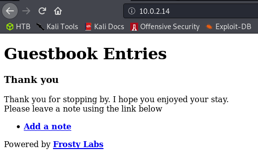
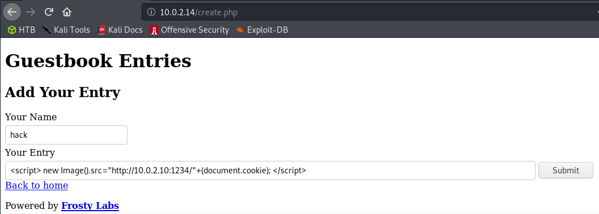
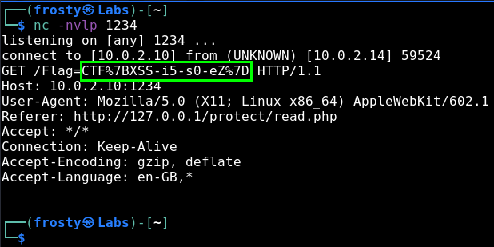

# Guestbook

## Description

It was nice of you to visit me today. I hope you are having a good time. I'll look at your feedback soon and if you're nice enough then I will give you a treat.

## Flag

```
CTF{XSS-i5-s0-eZ}
```

## Hints

1. Try to capture the request

2. Bankrobber HTB initial stage is very similar

3. XSS steal cookie.

## Solution

The "Your Entry" field allows for a long-ish comment to be added. Paste a payload like this to try and steal the cookie. Use `python SimpleHTTPServer xxxx` or `nc -nvlp xxxx` to capture the request. The cookie contains the flag.


## Pictures

Front page



Create entry page



Get the flag



## Setup


```
Install nginx, and PHP plugin
  https://www.digitalocean.com/community/tutorials/how-to-install-linux-nginx-mysql-php-lemp-stack-in-ubuntu-16-04
  protect /var/www/html/protect dir
  `htpasswd -c /var/www/html/.htpasswd USERNAME`
  Setup root dir /var/www/html/public

  Use (and adjust if required) nginx config in this repo.
  [ ]nginx config
```

```
Install MySQL
  https://tecadmin.net/install-mysql-server-on-debian9-stretch/

Edit /etc/php/7.3/fpm/php.ini
  cgi.fix_pathinfo=0
```

```
Setup MYSQL db
  mysql -u <username> -p < init.sql

  !Remember to put the password in the /var/www/html/data/config.php file
```

```
Setup remaining web files

- Install PhantomJS
  https://www.vultr.com/docs/how-to-install-phantomjs-on-ubuntu-16-04
  (I included the zip file in this repo in other-requred-files in case
      the website goes down. Only 20MB anyway)

- Setup PhantomJS bot:
  Make bot run forever:
  [ ]xss-bot.js (Update the basic auth pw)
  [ ]run.sh
    while sleep 1; do phantomjs --ignore-ssl-errors=true --local-to-remote-url-access=true --web-security=false --ssl-protocol=any xss-bot.js; done;
```